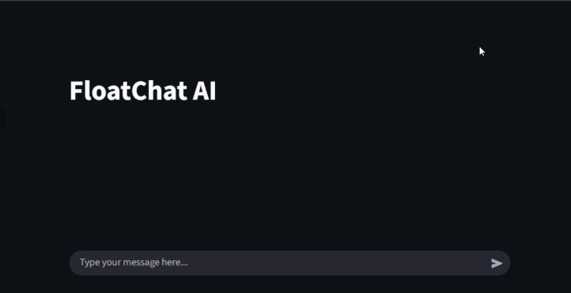

# FloatChat

FloatChat is an AI-powered conversational interface for interacting with ARGO oceanographic datasets.  
It enables natural language exploration, retrieval, and visualization of large-scale ocean measurements using a Retrieval-Augmented Generation (RAG) architecture.

The system integrates structured oceanographic datasets, semantic retrieval, and large language models to provide contextual answers to scientific queries.


## Demo

<p align="center">
  <a href="https://youtu.be/jRCr3fvkiHQ">
    
  </a>
</p>
---

# Architecture Overview

```
+---------------------------------------------------+
|                Client Interface                   |
|      Chat UI / Visualization Dashboard           |
+---------------------------------------------------+
|                Application Layer                  |
|        Query Processing / Session Control        |
+---------------------------------------------------+
|                 RAG Pipeline                      |
|   Query Parsing → Retrieval → Context Assembly   |
+---------------------------------------------------+
|              Retrieval Components                 |
|                                                   |
|   +----------------+    +----------------------+   |
|   | Vector Store   |    | Relational Database  |   |
|   | (Embeddings)   |    | (Structured Data)    |   |
|   +----------------+    +----------------------+   |
|                                                   |
+---------------------------------------------------+
|                Data Processing                    |
|      NetCDF Parsing / Feature Extraction         |
+---------------------------------------------------+
|                  Data Sources                     |
|           ARGO Float Oceanographic Data          |
+---------------------------------------------------+
```

---

# System Flow

```
User Query
   │
   ▼
Natural Language Processing
   │
   ▼
Query Interpretation
   │
   ▼
Parallel Retrieval
   ├── Vector Search (Semantic context)
   └── SQL Query (Structured data)
   │
   ▼
Context Aggregation
   │
   ▼
LLM Response Generation
   │
   ▼
Visualization + Answer
```

---

# Core Components

### Data Ingestion
- Parses ARGO float datasets (NetCDF format)
- Extracts oceanographic parameters
- Normalizes and stores measurements

### Retrieval Layer
- **Vector Store** for semantic search
- **Relational Database** for structured queries
- Hybrid retrieval for contextual grounding

### RAG Pipeline
- Query interpretation
- Context retrieval
- LLM response generation

### Visualization
- Graphical exploration of retrieved measurements
- Interactive analysis of ocean parameters

---

# Data Pipeline

```
ARGO NetCDF Data
      │
      ▼
Data Parsing
      │
      ▼
Feature Extraction
      │
      ▼
Structured Storage (SQL)
      │
      ├── Embedding Generation
      │        │
      │        ▼
      │   Vector Database
      │
      ▼
Queryable Knowledge Layer
```

---

# Key Capabilities

- Natural language querying of oceanographic datasets
- Hybrid semantic + structured retrieval
- Context-aware scientific responses
- Visualization of ocean parameters
- Scalable ingestion of ARGO float data


